# openrsc-agent-cli

An agent-facing command-line interface for controlling and inspecting a live
[OpenRSC](https://github.com/Open-RSC) client through [IdleRSC]. It sends small
JavaScript programs to a bridge running inside IdleRSC, then returns structured
results to the calling agent or shell.


## CLI examples

The default command returns a compact live observation. Use semantic commands
for ordinary inspection and interaction:

```sh
./irsc observe --fields player,npcs,menu
./irsc entities --type npc
./irsc map --radius 2
./irsc path 120 708
./irsc move 120 708 --radius 2
./irsc events --since 0
```

`move` returns an explicit terminal outcome, waits for positional settlement,
and includes the resulting scene; it does not require a follow-up shell sleep.
`talk npc:<id> --until menu` and `choose --contains <text>` provide the same
bounded interaction pattern for an observed option menu.

### Gameplay workflow

Use the semantic `irsc` commands for ordinary gameplay. They keep the action,
its outcome, and the observed scene together, which makes it possible to act
without relying on prewritten quest automation.

```sh
# Establish the live position and nearby NPC IDs.
./irsc inspect
./irsc entities --type npc

# Check a destination before moving, then make a verified move.
./irsc path 120 708
./irsc move 120 708 --radius 2

# Start an observed NPC conversation and inspect its choice menu.
./irsc talk npc:15 --until menu --deadline 8000
./irsc observe --fields player,npcs,menu
./irsc choose --contains 'tell me what the problem is'

# Read the resulting quest dialogue and continue from what it says.
./irsc logs --tail 30 --type QUEST
```

`talk` waits until a choice menu appears or its deadline expires. A result of
`completed` means the conversation progressed without a pending choice; use
`logs --type QUEST` to read its dialogue before deciding the next action.
`choose` only selects an option that is currently present in the observed
menu. Prefer `--contains` to a fixed option index when wording is known.

For movement, treat `succeeded`/`reached` as permission to take the next step.
If `move` returns `path_no_progress`, do not repeat the same long move: inspect
the local map with `./irsc map --radius 2` or `3`, take a short reachable leg,
and verify the new position before continuing. `path` is a reachability probe,
not a route executor, so a reachable result still benefits from bounded moves
around doors, rivers, and map boundaries.

Run a one-off JavaScript expression in the live client only when the semantic
commands are insufficient (for example, when developing or diagnosing the
bridge):

```sh
./irsc run -c 'JSON.stringify({loggedIn: controller.isLoggedIn(), x: controller.currentX(), y: controller.currentY()})'
```

Run a checked-in script:

```sh
./irsc run scripts/hello.js
```

Inspect the current player and nearby scene:

```sh
./irsc inspect
```

Probe nearby tile reachability:

```sh
./irsc map --radius 2
```

Read captured quest, chat, game, private-message, and trade events:

```sh
./irsc logs --tail 50
./irsc logs --tail 20 --type QUEST
```

The bridge defaults to `127.0.0.1:8765`. Request options include
`--host`, `--port`, and `--timeout` on `run`. Run `./irsc --help` for the
current command summary.

## What is in the repository?

- `bridge/` contains the bridge-owned Java IdleScript. It starts the local
  server, binds the IdleRSC controller, runs JavaScript workers, exposes
  read-only reachability probes, and captures incoming client messages.
- `cli/` contains the Node.js CLI, newline-delimited socket client, and the
  esbuild bundler used before source crosses into IdleRSC.
- `scripts/` contains agent- and user-authored JavaScript programs and shared
  helpers for observations, waits, dialogue, messages, and bounded workflows.
- `docs/` contains implementation decisions, API discoveries, and notes from
  live-client exploration.
- `vendors/Open-RSC/IdleRSC/` is the pinned upstream IdleRSC submodule. It is
  used as the client/runtime dependency and is kept unchanged.
- `Makefile` provides environment checks, bridge setup, builds, launch, and
  smoke-test targets.

## How it works

```mermaid
flowchart LR
    subgraph startup[Startup and configuration]
        Env[".env\ncredentials, server, script"]
        Make["make run"]
        IdleRSC["IdleRSC client\nJava 8 + Nashorn"]
        Env --> Make --> IdleRSC
    end

    subgraph client[Agent-facing CLI process]
        Caller["Agent or shell"]
        CLI["./irsc\nsemantic commands or run"]
        Bundle["Read script and bundle\nlocal ES modules when needed"]
        Frame["Newline-delimited JSON\nrun request with base64 source"]
        Caller --> CLI --> Bundle --> Frame
    end

    subgraph bridge[BridgeScript inside IdleRSC]
        Entry["BridgeScript\nIdleScript entry point"]
        Server["ScriptServer\n127.0.0.1:8765"]
        Queue["Single blocking request\nworker.start(); worker.join()"]
        Worker["ScriptWorker\nNashorn JavaScript evaluation"]
        Bindings["Live bindings\ncontroller, botController, walkability,\ndialogue/messages, console"]
        Entry --> Server --> Queue --> Worker --> Bindings
    end

    subgraph game[Live client state]
        API["IdleRSC controller APIs\nmovement, entities, menus, inventory"]
        World["OpenRSC game world"]
        API <--> World
    end

    subgraph events[Message capture]
        Interrupts["IdleScript interrupts\nQUEST, CHAT, GAME, PRIVATE, TRADE"]
        Buffer["MessageBuffer\nbounded in-memory event stream"]
        JSONL["logs/idlersc-bridge-messages-*.jsonl"]
        Interrupts --> Buffer --> JSONL
    end

    IdleRSC --> Entry
    Frame -->|"TCP loopback"| Server
    Bindings <--> API
    World --> Interrupts
    Worker -->|"JSON result or error"| Server
    Server -->|"TCP response"| CLI
    CLI -->|"./irsc events"| Buffer
    CLI -->|"./irsc logs"| JSONL
```



`BridgeScript` is loaded by IdleRSC as a native `IdleScript`. It starts a
loopback-only server on port `8765`. The CLI reads a script as text, optionally
bundles local imports with esbuild, base64-encodes the result, and sends a
newline-delimited JSON `run` request. The Java side evaluates the payload in a
Java 8 Nashorn context with bindings including `controller`, `botController`,
`walkability`, `messages`, `dialogue`, and `console`.

Scripts are deliberately observation-first. Shared helpers can report state,
wait for bounded conditions, verify movement or inventory transitions, and
record messages, but they do not contain a universal quest database or hidden
quest routes.

## Setup

Initialize the upstream submodule and configure credentials:

```sh
git submodule update --init --recursive
cp .env.example .env
```

Set `IDLE_USERNAME` and `IDLE_PASSWORD` in `.env`. `IDLE_SERVER` may be set to
`uranium` or `coleslaw`, and `IDLE_SCRIPT` should be `BridgeScript`.

Install the Node.js dependency used for bundling scripts:

```sh
npm install
```

Check and build the client:

```sh
make check
make build
```

Launch IdleRSC with the bridge enabled:

```sh
make run
```

Once the client is logged in and the bridge is running, use `./irsc` commands
from another terminal. The project currently targets the Java 8 runtime and
the Nashorn JavaScript engine supplied by that environment.

## Current scope

The current implementation supports one blocking script request at a time,
semantic observation, navigation, dialogue, and choice commands, inline or
file-based JavaScript, local ES module bundling, reachability probes, and
durable JSONL message logs. The CLI timeout only limits the client request; it
does not yet guarantee cancellation of a Java worker that is still running.

This repository owns the bridge and CLI code. Do not copy or run the
pre-written quest automation in the upstream IdleRSC source; gameplay behavior
should be discovered through the live client, controller API, observations,
logs, and screenshots.

[IdleRSC]: https://github.com/Open-RSC/IdleRSC
